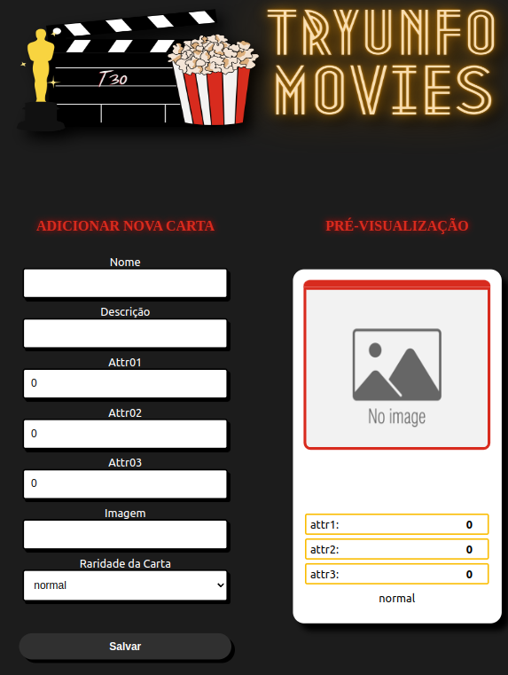
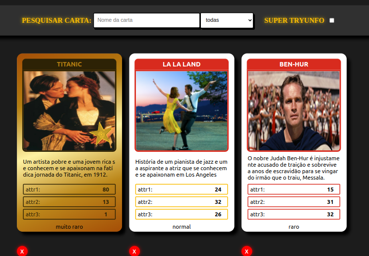

# PROJETO TRYUNFO

## 🎯 Objetivo

Essa aplicação simulará um jogo de **Super Trunfo**.Na renderização das cartas, sua aplicação deverá possuir três filtros de listagem de cartas: filtro por **nome**, por **raridade** e por **Super Trunfo**. Os filtros **nome** e **raridade** são acumulativos. O filtro **Super Trunfo** funciona de forma independente.

## :heavy_check_mark: Requisitos do Projeto 

 - [x] Crie o formulário que será usado para adicionar cartas ao baralho
 - [x] Adicione as props necessárias ao componente de formulário
 - [x] Crie e renderize o componente Card com as props necessárias
 - [x] Crie o preview da carta que está sendo criada pelo formulário
 - [x] Faça a validação do botão de Salvar no formulário
 - [x] Crie a função do botão salvar
 - [x] Crie a validação do Super Trunfo
 - [x] Exiba a lista de cartas que estão salvas no estado
 - [x] Crie um botão para remover uma carta do baralho
 - [x] Crie o filtro pelo nome da carta
 - [x] Crie o filtro por raridade da carta
 - [x] Crie o filtro de Super Trunfo

## 📝 Habilidades Adquiridas

  1. Ler o estado de um componente e usá-lo para alterar o que exibimos no browser
  2. Inicializar um componente, dando a ele um estado pré-definido
  3. Atualizar o estado de um componente
  4. Capturar eventos utilizando a sintaxe do React
  5. Criar formulários utilizando sintaxe JSX com as tags: `input`, `textarea`, `select`, `form`, `checkbox`
  6. Transmitir informações de componentes filhos para componentes pais via callbacks
  
  ## :hammer: Ferramentas 
  :small_orange_diamond:React
  :small_orange_diamond:JavaScript ES6+
  :small_orange_diamond:CSS
  

  
<strong>:information_source: Informações Adicionais </strong>
 

  ### Informações sobre o Super Trunfo

  O Super Trunfo é um jogo de cartas que ficou muito popular no Brasil entre as décadas de 80 e 90, mas que faz bastante sucesso até hoje. Suas regras são bastante simples, por isso ele é considerado um jogo fácil de jogar. Apesar de ter regras simples, cada baralho  de Super Trunfo pode ter um tema diferente, o que o torna um jogo bastante divertido.

  Originalmente, o jogo de Super Trunfo é formado por um baralho de 32 cartas. Cada carta representa um item relacionado ao tema do jogo. Em cada carta também existe uma lista com características daquele item e cada característica possui um valor numérico. 

  Para começar o jogo, as cartas devem ser embaralhadas e divididas igualmente para cada participante. Em cada rodada cada pessoa pega somente a primeira carta do seu monte. Na primeira rodada uma pessoa escolhe qual característica quer comparar com as cartas das outras pessoas que estão jogando. Ganha quem tiver o maior número nessa característica. A pessoa que ganhou a rodada recebe as cartas das outras pessoas e escolhe qual característica quer comparar na próxima rodada. O jogo termina quando alguma pessoa tiver todas as cartas do baralho.

  Em cada baralho existe uma (e somente uma) carta Super Trunfo. Essa carta ganha de todas as outras cartas do baralho, independentemente dos valores das características.

  O jogo de Super Trunfo pode ser feito com praticamente qualquer tema, mas tradicionalmente os mais comuns são: carros, países, cidades ou animais.

## 🎨 Layout

   
   

